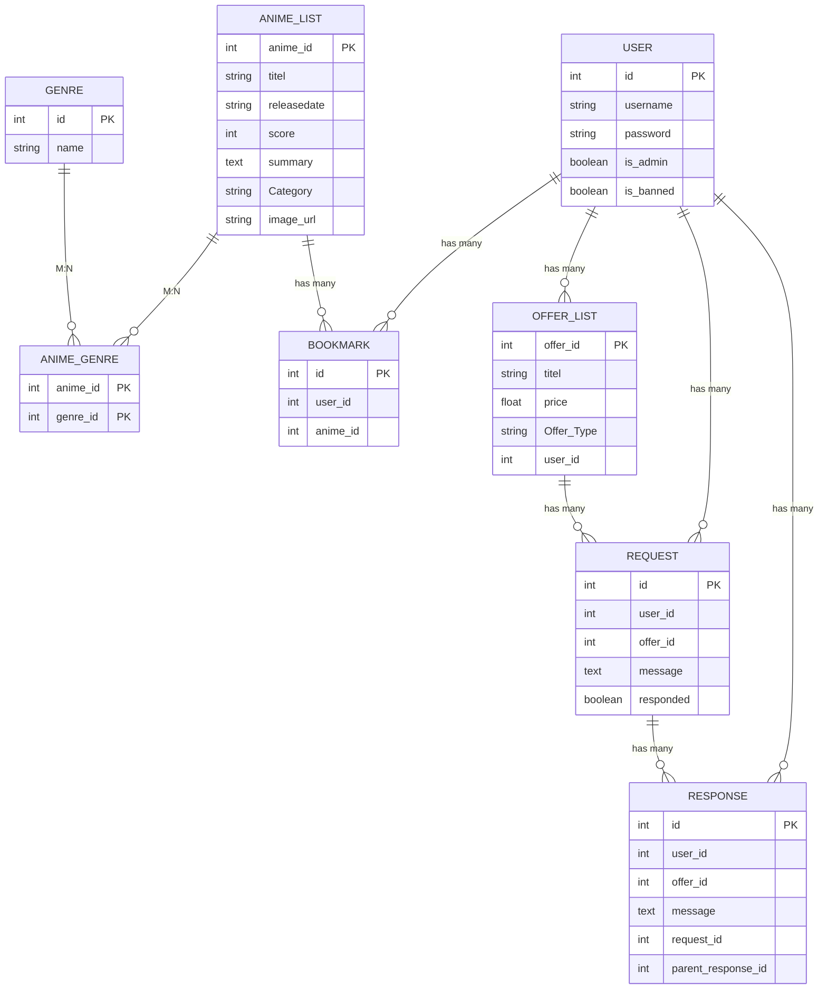

## Datenbankmodell (Mermaid-Diagramm)

Nachfolgend eine komprimierte Version des Modells ohne HTML-Anmerkungen, damit das Diagramm fehlerfrei gerendert werden kann:

### Erklärung des Datenmodells

1. **USER**  
   - Hält grundlegende Benutzerdaten (z. B. `username`, `password`) und Flags wie `is_admin` und `is_banned`.  
   - Ein `User` kann mehrere `Bookmarks`, `Requests`, `Responses` und `OfferList`-Einträge haben.

2. **GENRE**  
   - Enthält eine einfache Namensspalte.  
   - M:N-Beziehung zu `ANIME_LIST` über die Zwischentabelle `ANIME_GENRE`.

3. **ANIME_LIST**  
   - Repräsentiert einen Anime mit Feldern wie `titel`, `releasedate`, `score` etc.  
   - Enthält eine 1:n-Beziehung zu `BOOKMARK` sowie eine M:N-Beziehung zu `GENRE`.

4. **ANIME_GENRE**  
   - Eine reine Zwischentabelle, um die M:N-Verknüpfung zwischen `ANIME_LIST` und `GENRE` abzubilden.

5. **BOOKMARK**  
   - Verbindet einen `User` mit einem `AnimeList`-Eintrag (1:n von User und 1:n von AnimeList).

6. **OFFER_LIST**  
   - Alle Angebote, die ein `User` erstellen kann.  
   - Zeigt auf ein bestimmtes `ANIME_LIST`-Objekt (im Originalcode über den Spaltennamen `titel` verknüpft).

7. **REQUEST** und **RESPONSE**  
   - **REQUEST**: Eine Anfrage eines Nutzers (`user_id`) an ein Angebot (`offer_id`); kann bereits „responded“ oder noch offen sein.  
   - **RESPONSE**: Antwort auf eine `REQUEST`-ID. Enthält außerdem `offer_id` und den Nutzer, der antwortet.  
   - 1:n-Beziehung: Ein `REQUEST` kann mehrere `RESPONSE`-Einträge haben.  

Dieses Diagramm bietet einen schnellen Überblick über alle Tabellen und die Art, wie sie miteinander verknüpft sind. Die Beziehungen verdeutlichen, wo Fremdschlüssel zum Einsatz kommen (z. B. `user_id`, `offer_id`) und wie M:N-Strukturen (z. B. Genres) realisiert sind.
